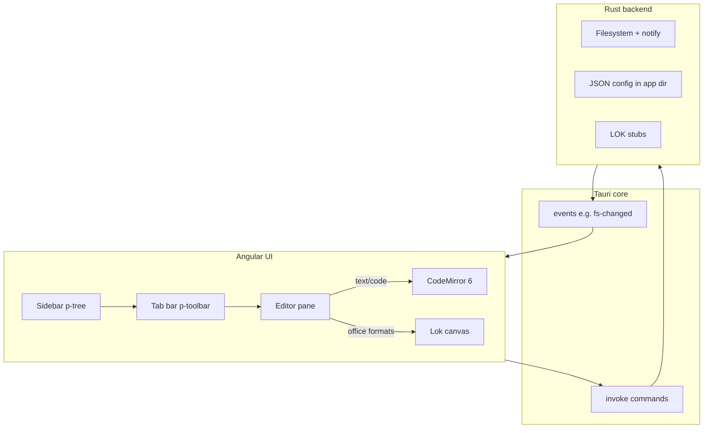

# uniED architecture

uniED is a **Tauri 2** desktop shell with an **Angular** renderer and **PrimeNG** as the UI component library. There is **no Electron** runtime.

## High-level diagram

## Packages

| Path | Role |
|------|------|
| `packages/renderer` | Angular app (standalone components), PrimeNG, CodeMirror |
| `packages/shared-types` | Shared TypeScript types and `TAURI_CMD` names |
| `src-tauri` | Rust: commands for FS, config, file watching; LOK placeholders |

## Security

All filesystem and native access is enforced in **Rust**. The webview only calls explicit Tauri commands; paths are validated (absolute paths, etc.) in the backend.

## LibreOfficeKit

LOK integration is **not** implemented in Rust yet. `lok_*` commands return a clear error until a native LO layer is added (e.g. `libloading` of `libmergedlo.so` or a dedicated sidecar). See [LOK_INTEGRATION.md](LOK_INTEGRATION.md).
